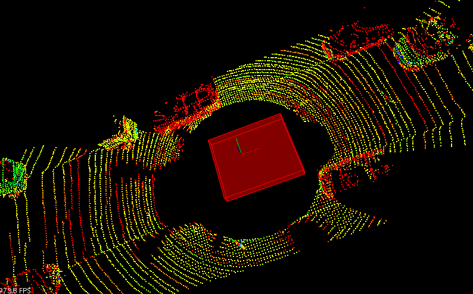

# lidar-obstacle-detection


## Obstacle detection using lidar data

Processing point clouds, and use it to detect car and trucks on a narrow street using  
lidar.

Detection pipeline : filtering -> segmentation -> clustering -> bounding boxes.

Segmentation and clustering methods are created from scratch.

### Lidar Point Cloud

This is the sample lidar city point cloud which is used in the project to test the  
obstacle detection pipeline.


### Filtering

Filtering is the first step in removing points not in region of interest (ROI).  
In addition to that points cloud is downsampled to appropiate [Voxel Grid](https://en.wikipedia.org/wiki/Voxel)  
in order to improve the computation efficiency as shown in below image.


### Segmentation

Point clouds is separated into obstable cloud and plane cloud using RANSAC algorithm  
implemented from scratch.

Below is the simulated scenario shown with lidar rays rendered


Following is the segmentation output, as seen in the image point clouds is segmented  
into two parts as plane cloud and obstacle cloud. All the points that belong to plane  
cloud (Road surface) is shown in green and the obstacle cloud is rendered in red color.


### Clustering

Euclidean Clustering method implemented using KD tree is used to cluster the obstable  
cloud obtained from Segmentation. Which is later used to track objects. 

Below is the image of KD-Tree implementation that was able to cluster 2D points


KD-Tree implmentation is then extended to support 3D PCL point clouds.

Then based on the principles of Euclidean clustering clusters are extracted from  
obstacle points cloud using KD-Tree implemented earlier.

Results seen after applied clustering on the above shown sample simulated data is shown  
below where three clusters are extracted from obstacle points cloud and each cluster  
is marked with different color.


### Bounding Box

Below figure shows the bounding box drawn using pcl library around the clusters  
indentified in clustering step.


To account for the vehicles direction in advanced driving scenarios, minimum oriented  
bounding box of the cluster point cloud is drawn using the Principle Component analysis  
by projecting obstacles on xy plane.


In addition to that a bounding box is also drawn to show the roof of the vehicle as  
shown below



### Putting it all together

Finally plumbing everything in the pipeline we have the following image which detects  
obstacles (vehicles, pole, pedestrians) in the ROI.


## Installation

### Docker

```bash
$> docker pull ragumanjegowda/docker:latest
```

### Ubuntu 

```bash
$> # I have not tested on host Ubuntu, this worked with my DockerImage 
$> sudo apt install libproj-dev libpcl-dev ninja-build cmake
```

### MAC (via Homebrew)

```bash
$> brew tap brewsci/science
$> brew install pcl
$> brew install ninja cmake
```


## Build and Run

```bash
$> mkdir build && cd build
$> cmake -G Ninja ..
$> ninja -j400
$> ./environment
```